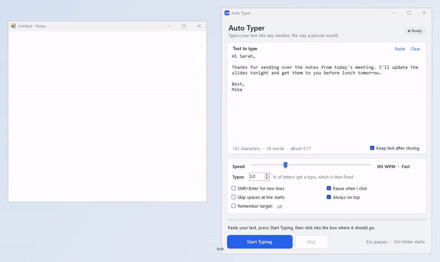
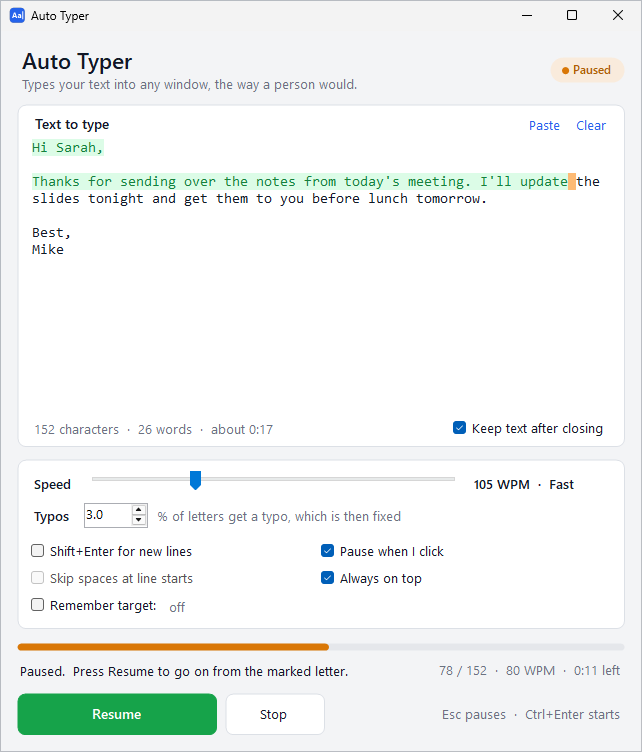

# Auto Typer

Auto Typer types your text into any window on your PC, one key at a time, the way a real person would. Paste your text, click **Start Typing**, click into the box where it should go, and watch it type.

[Watch the full-quality video (MP4)](docs/demo.mp4)

In the clip above, Auto Typer types a short note at about 105 words per minute. It makes a couple of typos along the way and fixes them. Partway through, we click on Auto Typer's own window, so typing pauses. Then we hit **Resume** and it picks up right where it left off.

## What it does

- **Types like a person.** The rhythm speeds up and slows down on its own. Common letter pairs come out faster, and it takes little breaks after commas, periods, and new lines. Every now and then it hits a wrong key, notices, backspaces, and fixes it.
- **Shows you where it is.** Text that's already typed turns green, and the next letter gets a yellow marker. You'll also see live words per minute and how much time is left.
- **Pauses when you need it to.** Switch to another window, click somewhere, or press **Esc**, and typing stops right away. Click **Resume** and it goes back to the same window and keeps going from the same letter. If it stopped in the middle of a typo, it cleans that up first.
- **Types just part of your text.** Highlight a section before you hit Start, and it types only that.
- **Types into remote computers, too.** Run it on your own PC and click into a Remote Desktop, Parsec, AnyDesk, or similar window. The text gets typed on the remote machine, just like you were typing it yourself. It notices when you're typing into a remote window and switches to a more careful mode on its own.
- **Remembers where it typed last time.** Next time you hit Start, it switches straight back to that window. No clicking needed.
- **Handles accents, symbols, and emoji.** If a character isn't on your keyboard (like é or 😀), it still gets typed. It works with any keyboard layout, including ones with accent keys like US-International, German, or French, and with Caps Lock on.
- **Remembers your settings.** Your speed, options, and text are still there the next time you open it.

## Getting started

You'll need Windows 10 or 11. There's nothing to install.

1. Download [`dist/AutoTyper.exe`](dist/AutoTyper.exe) and double-click it.
2. Paste or type your text into the big box.
3. Set the speed and how often you want typos (set it to 0% if you don't want any).
4. Click **Start Typing** (or press **Ctrl+Enter**).
5. Click into the text box where you want the text to go, whether that's an email, a document, a chat window, or even a box on a remote computer. Typing starts a moment later.

Keep your hands off the keyboard while it types. If you're holding down Ctrl, Alt, or the Windows key, Auto Typer waits until you let go so it doesn't accidentally trigger a shortcut.

## Pausing and resuming

Typing pauses when:

- you switch to another window,
- you click anywhere (you can turn this off, see below),
- you press **Esc**, or
- you click **Pause**.

When it pauses, the next letter to type turns orange and the big button turns into a green **Resume** button. Click it and Auto Typer brings the same window back to the front, puts the cursor back in that box, and keeps going.

One thing to watch for: Auto Typer can't see inside other apps. So if you click somewhere else in the box while it's paused, it'll continue from wherever your cursor is now. Just click back at the end of the text before you hit Resume.

Want to start over instead? Click **Stop**.

## Options

| Option | What it's for |
| --- | --- |
| **Speed** | How fast it types, in words per minute. Most people type somewhere between 40 and 80. The pauses and typo fixes are built into the speed, so longer texts finish close to what you set. Short ones run a little slower, since it eases into it at the start like a person would. |
| **Typos** | The chance that any given letter comes out wrong (then gets fixed). Around 1–3% looks natural. Set it to 0 to turn typos off. |
| **Shift+Enter for new lines** | Turn this on for chat apps like Slack, Teams, or WhatsApp, where pressing Enter sends the message. |
| **Code editor mode** | Turn this on when typing code into an editor like VS Code, LeetCode, HackerRank, Replit, or Jupyter. Those editors indent new lines, close brackets, and pop up autocomplete on their own, which normally wrecks typed code. In this mode every line gets exactly the indentation from your text, brackets the editor added by itself get dropped (so you don't end up with `}}`), and autocomplete can't swallow the Enter key. Start on an empty line or at the end of the code. |
| **Remote PC** | Remote desktop apps sometimes lose symbols like ², — or é, and can repeat a letter when keys come in too fast ("angullllar"). Remote PC mode fixes both: it presses each key a little more deliberately and types symbols as Windows Alt codes, which always get through. **Automatic** turns it on whenever you type into Parsec, AnyDesk, Remote Desktop, TeamViewer, RustDesk, VNC, VMware, VirtualBox, or Hyper-V. If your remote app isn't on that list, choose **Always on**. |
| **Pause when I click** | Pauses on any mouse click, since a click can move the cursor. Turn it off if you want to keep clicking around while it types. |
| **Always on top** | Keeps the Auto Typer window above everything else so you can always see the progress. |
| **Keep text after closing** | Saves your text so it's still there next time. Turn it off if you're typing anything private. |
| **Remember target** | After a run, it remembers the window it typed into, and the next Start goes right back there. Click **Forget** to clear it. |

## Keyboard shortcuts

| Keys | What they do |
| --- | --- |
| **Ctrl+Enter** | Start typing (or resume) while the Auto Typer window is active |
| **Esc** | Pause typing, no matter which window you're in |

## Tips and troubleshooting

**It paused and says Windows blocked the keys.** That app is running as administrator, and Windows won't let a regular app type into it. Right-click Auto Typer and choose **Run as administrator**, then try again. Auto Typer also pauses on its own if the screen locks or a security prompt pops up while it types, so none of your text gets lost.

**It won't type into an app that's minimized to the tray.** That's on purpose. If the window you typed into last time is hidden (Discord, Slack, and Teams do this when you close them), Auto Typer asks you to click into a box instead of typing where you can't see it.

**Typing on a remote computer.** You don't have to install anything on the remote machine. Keep Auto Typer on your own PC, click Start Typing, then click inside the remote window, right where the text should go. Auto Typer sends real key presses, so Remote Desktop, Parsec, AnyDesk, and similar tools pass them along like your own typing. A few things help:

- Use the same keyboard layout (like US English) on both computers. Otherwise some symbols can come out as different characters.
- Keep the remote window in front while it types. Switching away pauses it, same as always.
- The status line says "Typing in Remote PC mode" when the careful mode is on. If it doesn't, set **Remote PC** to **Always on**.
- Alt codes need the remote computer to be running Windows. They cover the common symbols (², ³, ±, ×, ÷, °, ½, curly quotes, dashes, €, ≤, ≥, √, π, ∞, accented letters, and more). A math minus sign (−) goes in as a regular hyphen, which looks the same. Math symbols like ≤, √, and π depend on the remote PC's language settings (they're right on US systems). For those, and for anything with no Alt code at all (emoji, for example), Auto Typer tells you to double-check them on the other PC when it's done.

**Letters get repeated, like "angullllar".** That happens on remote computers when a key press arrives too fast and the other side thinks the key is still held down. Remote PC mode prevents it. Make sure it's on (see above).

**Typing code.** Turn on **Code editor mode** first. Without it, the editor's own indentation stacks on top of yours and every line drifts further to the right, and you get doubled closing brackets. Click on an empty line (or at the very end of the code) before you start. In this mode, when a line ends with `{`, `(`, `[`, or `>`, anything after the cursor on that line gets replaced. One thing it can't fix: HTML editors that close a tag in the middle of a line (type `<b>` and get `<b></b>`) may still leave an extra closing tag.

**A few characters look wrong in one app.** Some apps (mostly games) ignore characters that aren't on the keyboard, like é or emoji. Plain letters, numbers, and punctuation work everywhere. Setting **Remote PC** to **Always on** often helps there too, since it types symbols as Alt codes.

**Where are my settings stored?** In `%APPDATA%\AutoTyper` (paste that into File Explorer's address bar). Delete the folder to reset everything. Nothing ever leaves your computer, and Auto Typer doesn't use the internet at all.

Please only use Auto Typer where automated typing is allowed.

## Building it yourself

You don't need Visual Studio or anything else installed. Windows already comes with the C# compiler this project uses.

1. Download or clone this folder.
2. Double-click `build.bat`.
3. Your new copy shows up at `dist\AutoTyper.exe`.

If the build says it can't write the file, close Auto Typer first and run it again.

### How the code is organized

| File | What's in it |
| --- | --- |
| `TypingPlan.cs` | Decides what to press and when: the rhythm, the pauses, and the typos |
| `Typist.cs` | Sends the actual key presses and watches for anything that should pause typing |
| `MainForm.cs` | The window layout and options |
| `MainForm.Typing.cs` | Starting, pausing, resuming, the green highlight, and the live stats |
| `Controls.cs` | Colors, the custom buttons and progress bar, and saved settings |
| `AutoTyper.cs` | The entry point |
| `assets/` | The app icon: `AutoTyper.ico` for the exe, `Window.ico` for the window |
